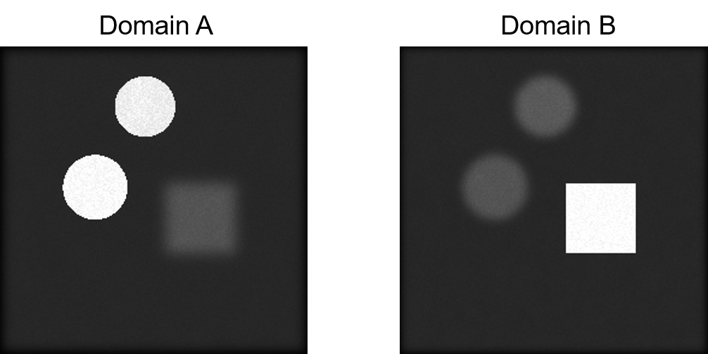
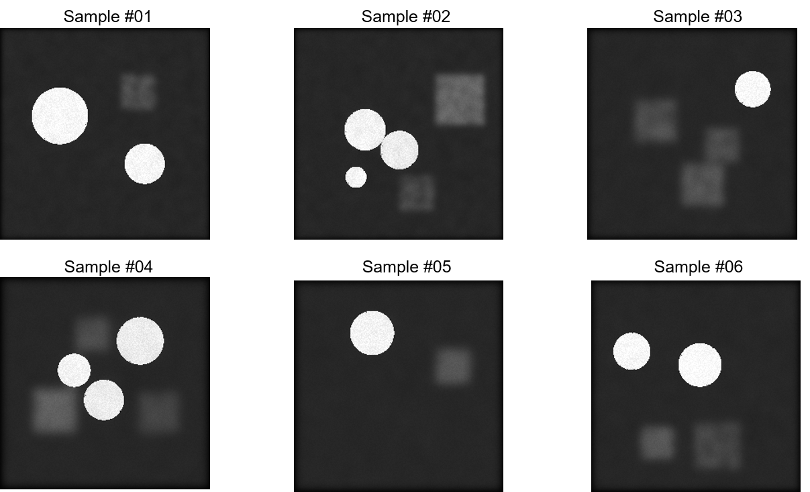
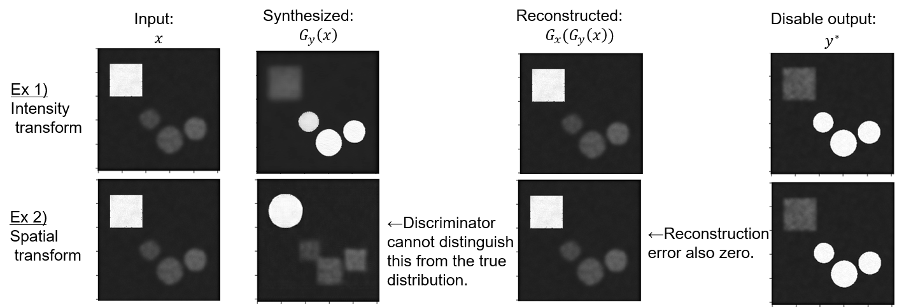
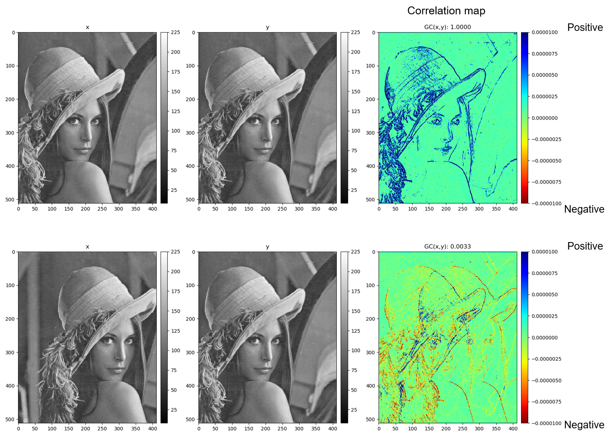

# PyTorch Similarity Measure

This is a PyTorch implementation of similarity measure for 1D, 2D and 3D inputs, including:
- [x] Normalized cross correlation
- [x] Gradient correlation
- [x] Gradient difference

For example, the gradient correlation was used in MR-to-CT synthesis using CycleGAN.
```
@inproceedings{hiasa2018cross,
  title={Cross-modality image synthesis from unpaired data using CycleGAN},
  author={Hiasa, Yuta and Otake, Yoshito and Takao, Masaki and Matsuoka, Takumi and Takashima, Kazuma and Carass, Aaron and Prince, Jerry L and Sugano, Nobuhiko and Sato, Yoshinobu},
  booktitle={International Workshop on Simulation and Synthesis in Medical Imaging},
  pages={31--41},
  year={2018},
  organization={Springer}
}
```
Let's consider following toy problem, a situation where circles are clear in domain A while unclear in domain B.
On the other hand, the square is unclear in the domain A and clear in the domain B.



<details><summary> Note that each domain has the variations in the number, position and size of objects. </summary><div>

</div></details>

In this case, the loss function value of CycleGAN may converge even if it learns either intensity or shape transformation.
That is, it is not guaranteed that CycleGAN retains the original input shape.



Gradient correlation is one of the solutions for maintaining the original shape within unsupervised manner.

## Gradient correlation

The gradient correlation (GC) [Penney et al.] has been used as a similarity
measure in the medical image registration, which is defined by the normalized
cross correlation of the image gradient between two images.




These figures show the correlation map for two examples.
In the above aligned example, there is high correlation around the face contour (Blue color).

## Installation
- Install from this repository
```bash
git clone https://github.com/yuta-hi/pytorch_similarity
cd pytorch_similarity
python setup.py install
```
